# Realtime Chat

<!-- badges: update the repo slug once this pushes to GitHub -->
<!-- replace `debdutsaha/realtime-chat` with your own org/repo if you fork -->

[](https://github.com/debdutsaha/realtime-chat/actions/workflows/ci.yml)
[](./LICENSE)
[](./.nvmrc)
[](./apps/mobile)
[](./packages/tsconfig)

An offline-first, realtime 1:1 and group messaging app built end-to-end to demonstrate senior-level craft across **React Native (New Architecture)**, **animations (Reanimated 4 / Worklets)**, **offline sync (WatermelonDB + JSI)**, and a **production-grade backend** on Node.js, Fastify, Socket.IO, and Postgres — deployed to Fly.io.

This is not a toy. Every decision in this repo is deliberate and traceable to a real product concern: latency, reliability on bad networks, data consistency, security, developer ergonomics, and deploy confidence.

## Screens

A product tour, grouped by user journey. Each caption ties the screen to the engineering work behind it — the UI is the tip of the iceberg.

### Sign in / sign up

<table>
  <tr>
    <td align="center" width="50%">
      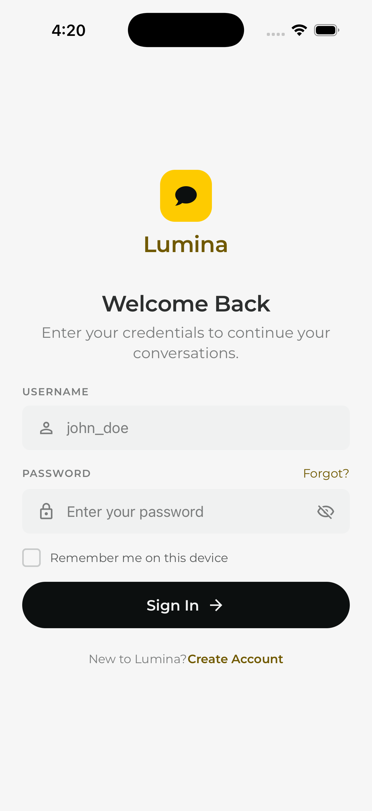
      <br/><sub><b>Sign in</b> — argon2id on the server, rate-limited at 10/min/IP via <code>@fastify/rate-limit</code>. Access token (15 min) + rotating refresh token (30 days, sha256-hashed in the DB).</sub>
    </td>
    <td align="center" width="50%">
      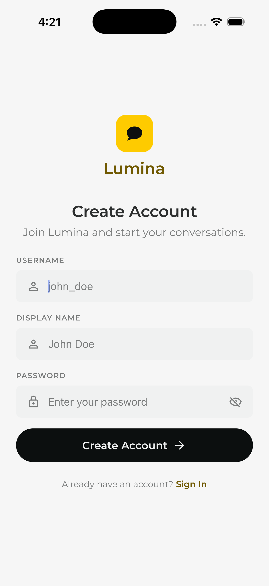
      <br/><sub><b>Create account</b> — handle uniqueness, server-side age ≥ 13 for the optional date of birth, E.164-validated phone.</sub>
    </td>
  </tr>
</table>

### First run — from empty to connected

<table>
  <tr>
    <td align="center" width="33%">
      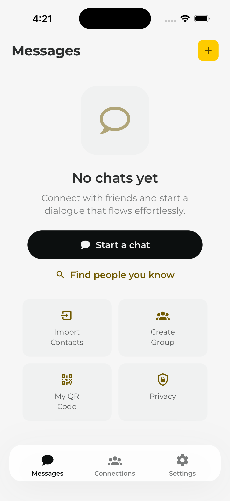
      <br/><sub><b>Empty chat list</b> — illustrated empty state with pull-to-refresh, not a blank white wall.</sub>
    </td>
    <td align="center" width="33%">
      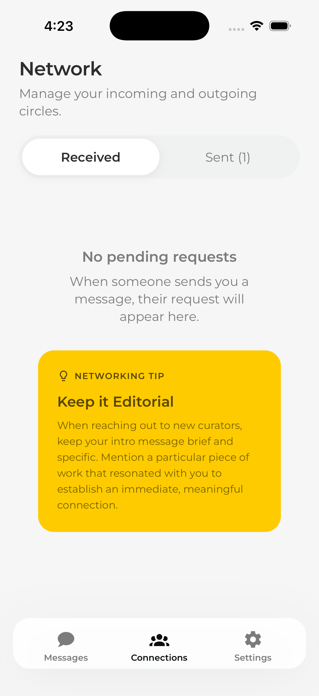
      <br/><sub><b>No connections yet</b> — contextual CTA to find people, not a dead end.</sub>
    </td>
    <td align="center" width="33%">
      
      <br/><sub><b>User search</b> — excludes existing connections + DM peers server-side (<code>GET /users?search=</code>).</sub>
    </td>
  </tr>
</table>

### Connection lifecycle

<table>
  <tr>
    <td align="center" width="33%">
      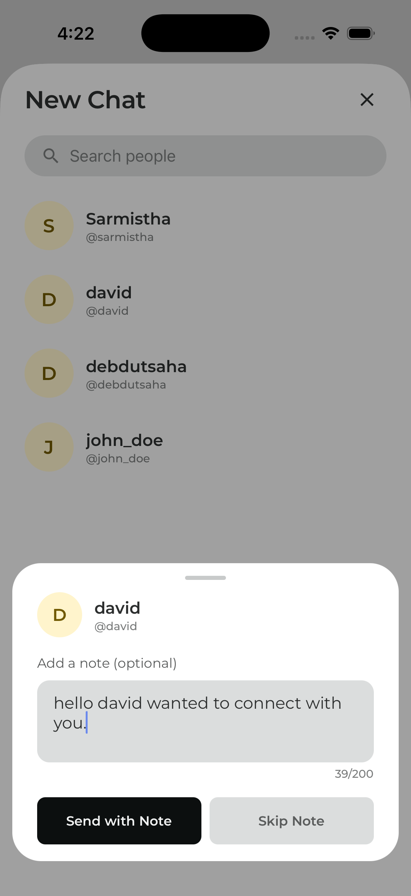
      <br/><sub><b>Send request</b> — optional first message, 280-char limit, Zod-validated on both sides.</sub>
    </td>
    <td align="center" width="33%">
      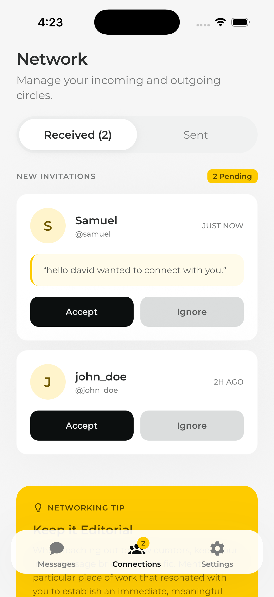
      <br/><sub><b>Pending (received)</b> — accept creates the DM room and emits a socket event to both parties inside a single <code>$transaction</code>.</sub>
    </td>
    <td align="center" width="33%">
      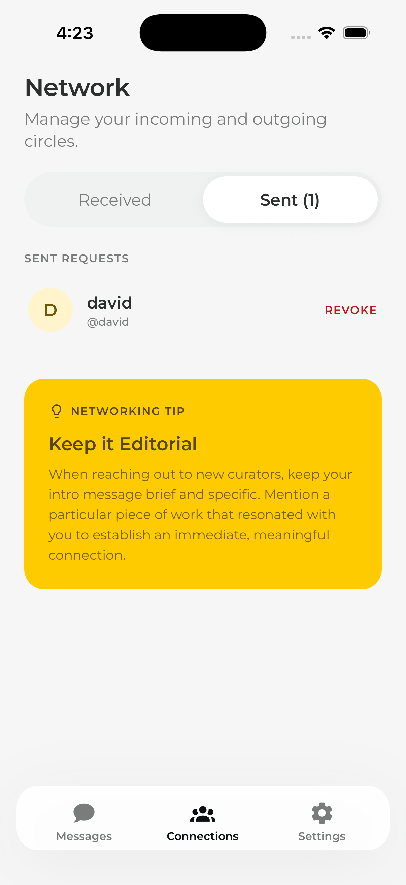
      <br/><sub><b>Sent tab</b> — revoke before the recipient accepts; status reflected in realtime.</sub>
    </td>
  </tr>
</table>

### Messaging

<table>
  <tr>
    <td align="center" width="33%">
      
      <br/><sub><b>Chat list</b> — FlashList, recycled cells, last-message preview from WatermelonDB observables.</sub>
    </td>
    <td align="center" width="33%">
      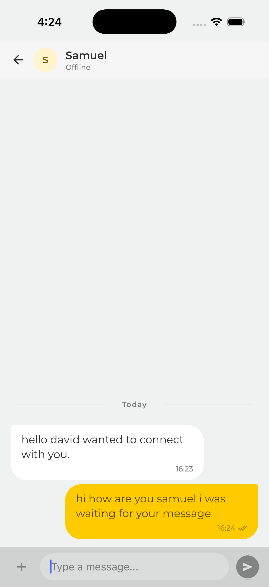
      <br/><sub><b>Chat room</b> — optimistic send with client-generated <code>clientId</code>, reconciled on server ack. Reanimated 4 bubble entries, sync keyboard.</sub>
    </td>
    <td align="center" width="33%">
      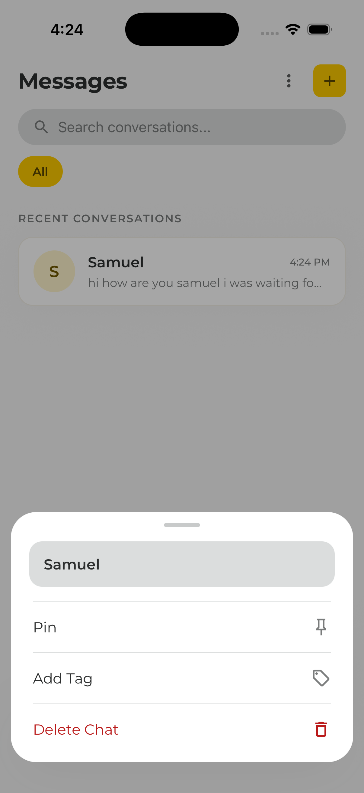
      <br/><sub><b>Long-press menu</b> — Gesture Handler 2 long-press; pin / tag / delete actions. Haptic feedback on trigger.</sub>
    </td>
  </tr>
</table>

### Organization with tags

<table>
  <tr>
    <td align="center" width="50%">
      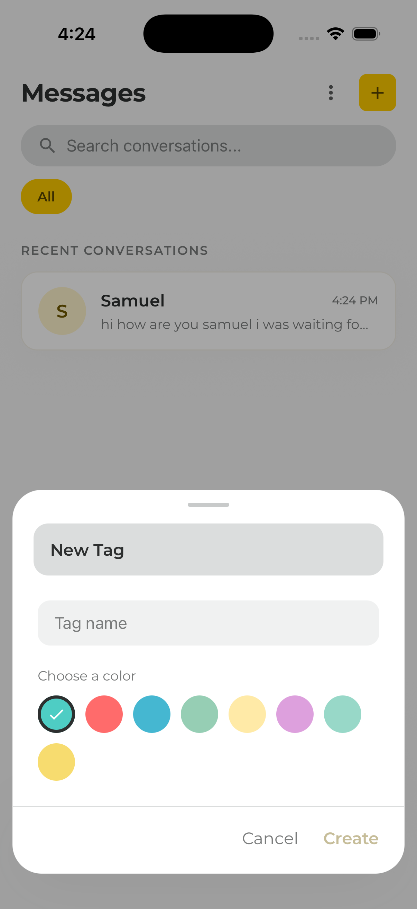
      <br/><sub><b>Create a tag</b> — color-coded, per-user, offline-first (local DB write → server sync when online).</sub>
    </td>
    <td align="center" width="50%">
      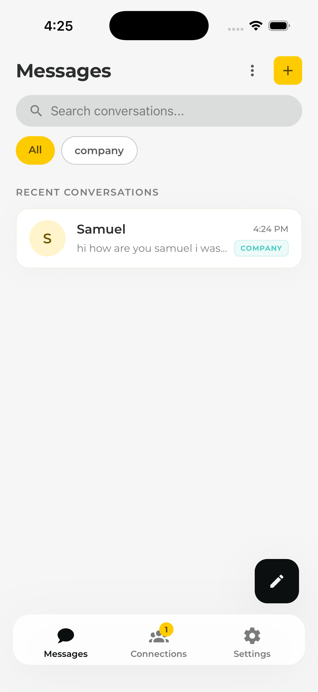
      <br/><sub><b>Tagged chat list</b> — filter chips, colored pills. The filter runs entirely off the local SQLite index — zero network.</sub>
    </td>
  </tr>
</table>

### Your account

<table>
  <tr>
    <td align="center" width="50%">
      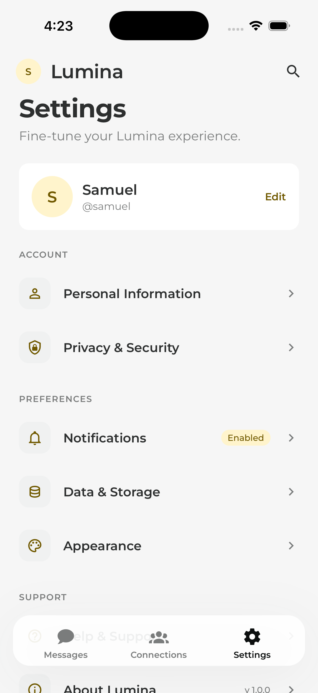
      <br/><sub><b>Settings</b> — navigation hub. Logout is local-only; "sign out from all devices" revokes every refresh token server-side.</sub>
    </td>
    <td align="center" width="50%">
      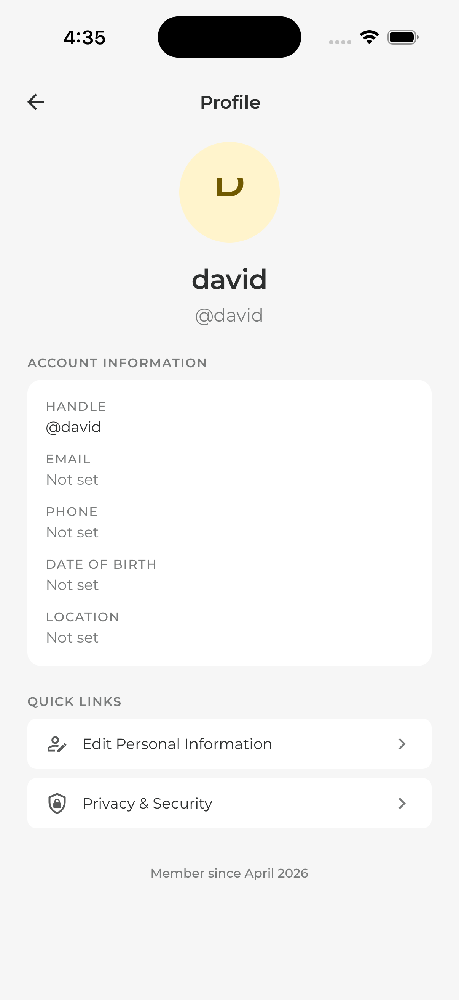
      <br/><sub><b>Profile</b> — what other people see: handle, display name, avatar. Read-only; <code>PublicUserSchema</code> in <code>@rtc/contracts</code> guarantees personal info never leaks through non-<code>/me</code> endpoints (see <a href="./docs/adr/0003-public-user-schema.md">ADR 0003</a>).</sub>
    </td>
  </tr>
  <tr>
    <td align="center" width="50%">
      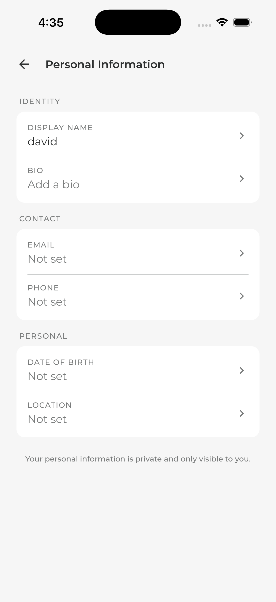
      <br/><sub><b>Personal information</b> — bio, email, phone, DOB, location, all optional. Per-field bottom-sheet editor with inline validation (E.164 phone, age ≥ 13, 280-char bio) and optimistic UI that rolls back on server rejection.</sub>
    </td>
    <td align="center" width="50%">
      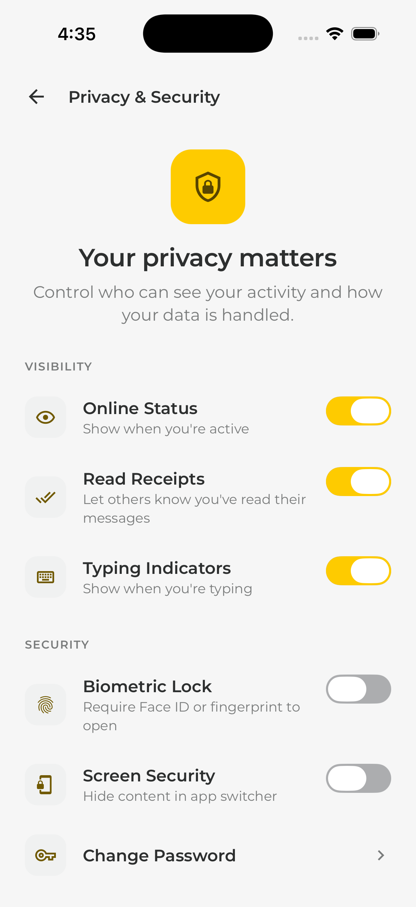
      <br/><sub><b>Privacy &amp; Security</b> — read receipts, online status, typing indicators. Bilateral: disabling stops both directions. Server enforces via a 5-minute Redis-cached lookup on the socket hot path (<a href="./docs/adr/0002-bilateral-privacy-model.md">ADR 0002</a>).</sub>
    </td>
  </tr>
</table>

## Try it

<!-- Replace these placeholders once you have real URLs. Keep the section here -->
<!-- rather than deleting it — even a "none yet, run locally via §10" entry is -->
<!-- more useful to a reviewer than silence. -->

| Target                     | Status              | Link                                                                                                                                                                                               |
| -------------------------- | ------------------- | -------------------------------------------------------------------------------------------------------------------------------------------------------------------------------------------------- |
| **Server API**             | 🟢 live             | [`https://rtc-chat.fly.dev/health`](https://rtc-chat.fly.dev/health) · Fly.io · Mumbai region. Point the mobile app here by flipping `USE_PROD` in `apps/mobile/src/foundation/network/config.ts`. |
| **iOS TestFlight**         | not yet published   | —                                                                                                                                                                                                  |
| **Android internal track** | not yet published   | —                                                                                                                                                                                                  |
| **Web demo**               | out of scope for v1 | —                                                                                                                                                                                                  |

Until the mobile builds are published, the fastest path to see it running is the [local development](#10-local-development) section — iOS simulator + `yarn workspace @rtc/server dev` gets you there in about 5 minutes.

---

## Table of contents

1. [The product thesis](#1-the-product-thesis)
2. [High-level architecture](#2-high-level-architecture)
3. [Repository layout](#3-repository-layout)
4. [Tech stack and why](#4-tech-stack-and-why)
5. [Offline-first sync engine — how it actually works](#5-offline-first-sync-engine--how-it-actually-works)
6. [Animation system](#6-animation-system)
7. [Backend design](#7-backend-design)
8. [Security model](#8-security-model)
9. [Type safety across the wire](#9-type-safety-across-the-wire)
10. [Local development](#10-local-development)
11. [Deployment](#11-deployment)
12. [Technology choices](#12-technology-choices)
13. [Architectural tradeoffs](#13-architectural-tradeoffs)
14. [Recently shipped](#14-recently-shipped)
15. [What I'd build next](#15-what-id-build-next)

---

## 1. The product thesis

**Who it's for.** People chatting on flaky networks — commuters, travelers, field workers — where a dropped Wi-Fi handover should never cost a message. The north-star metric is _zero perceived loss_: every message typed must appear in the thread immediately, survive app kills, and reach the other side exactly once.

**The product bets.**

| Bet                                                 | Why                                                                                             | How it shows up in the app                                                        |
| --------------------------------------------------- | ----------------------------------------------------------------------------------------------- | --------------------------------------------------------------------------------- |
| **Optimistic UI is table stakes**                   | Users blame the app, not the network. Perceived latency beats real latency.                     | Every send renders instantly with a local ID, then reconciles on server ack.      |
| **Local database is the source of truth**           | Re-fetching on every mount is slow and wasteful. The UI should read from disk.                  | WatermelonDB with a JSI SQLite adapter — observables drive the FlashList.         |
| **The socket is an optimization, not a dependency** | The app has to work when the socket is gone.                                                    | REST + outbox drain as fallback; socket delivers low-latency push when available. |
| **Animation is UX, not polish**                     | A chat app lives or dies on feel. Swipe-to-reply, bubble entries, typing dots must feel native. | Reanimated 4 worklets, Gesture Handler 2, composed gestures, layout animations.   |
| **Type safety spans the network boundary**          | The #1 source of bugs in chat apps is drift between client and server schemas.                  | Shared Zod contracts validated on both ends of the socket.                        |

---

## 2. High-level architecture

```
 ┌──────────────────────────────────────┐       ┌──────────────────────────────────────────┐
 │           React Native App           │       │              Fastify Server              │
 │        (iOS + Android, 1 codebase)   │       │          (Node.js, Fly.io · Mumbai)       │
 │                                      │       │                                          │
 │   ┌────────────────────────────┐     │       │    ┌─────────────┐    ┌────────────┐     │
 │   │        UI Layer            │     │       │    │  REST API   │    │ Socket.IO  │     │
 │   │  FlashList · Reanimated 4  │     │       │    │  (Fastify)  │    │  gateway   │     │
 │   │  Gesture Handler · RN 0.85 │     │       │    └──────┬──────┘    └─────┬──────┘     │
 │   └──────────────┬─────────────┘     │       │           │                 │            │
 │                  │ observes          │       │           ▼                 ▼            │
 │   ┌──────────────▼─────────────┐     │       │    ┌────────────────────────────┐        │
 │   │     WatermelonDB           │     │       │    │        Zod validators      │        │
 │   │   (SQLite via JSI)         │     │       │    │     (@rtc/contracts)       │        │
 │   │   ← source of truth        │     │       │    └──────────────┬─────────────┘        │
 │   └──────────────┬─────────────┘     │       │                   │                      │
 │                  │ read/write        │       │          ┌────────▼──────────┐           │
 │   ┌──────────────▼─────────────┐     │       │          │   Service layer   │           │
 │   │      Sync Engine           │◄────┼───────┼─────────►│  (domain logic)   │           │
 │   │  · outbox · drain · ack    │     │       │          └────────┬──────────┘           │
 │   │  · idempotent replay       │     │       │                   │                      │
 │   └──────────────┬─────────────┘     │       │          ┌────────▼──────────┐           │
 │                  │                   │       │          │      Prisma       │           │
 │   ┌──────────────▼─────────────┐     │       │          └────────┬──────────┘           │
 │   │   Transport Adapters       │     │       │                   │                      │
 │   │  · axios (REST)            │     │       │                   ▼                      │
 │   │  · socket.io-client (WS)   │     │       │          ┌──────────────────┐            │
 │   └────────────────────────────┘     │       │          │   Postgres       │            │
 │                                      │       │          │   (Neon)         │            │
 └──────────────────┬───────────────────┘       │          └──────────────────┘            │
                    │                           │                                          │
                    │          HTTPS + WSS      │          ┌──────────────────┐            │
                    └───────────────────────────┼─────────►│      Redis       │            │
                                                │          │   (pub/sub fan-  │            │
                                                │          │    out across    │            │
                                                │          │    instances)    │            │
                                                │          └──────────────────┘            │
                                                └──────────────────────────────────────────┘
```

**Three design principles you can point to in any interview:**

1. **The local DB is the UI's only source of truth.** Components never `await fetch()` to render. They observe a WatermelonDB query. Network is a side channel that updates the DB.
2. **Every write is idempotent.** The client generates a UUID `clientId` before sending; the server treats it as the idempotency key. Replaying a send after a crash is safe by construction.
3. **The schema travels with the code.** A single Zod contract is imported by both the mobile app and the server. A breaking change doesn't compile — on either side.

---

## 3. Repository layout

```
realtime-chat/
├── apps/
│   ├── mobile/                 # React Native 0.85 (bare CLI, New Arch on)
│   │   ├── src/
│   │   │   ├── api/            # axios client + typed wrappers
│   │   │   ├── db/             # WatermelonDB schema + models (decorators)
│   │   │   ├── features/
│   │   │   │   ├── auth/
│   │   │   │   └── chat/       # FlashList, MessageBubble, InputBar, TypingDots
│   │   │   ├── sockets/        # socket.io-client wrapper
│   │   │   ├── sync/           # SyncEngine: outbox, drain, ack reconcile
│   │   │   └── state/          # Zustand stores (ephemeral only)
│   │   ├── ios/
│   │   └── android/
│   └── server/                 # Fastify + Socket.IO + Prisma
│       ├── src/
│       │   ├── routes/         # REST endpoints (auth, rooms, messages)
│       │   ├── sockets/        # Socket.IO namespaces + handlers
│       │   ├── lib/            # env, tokens, redis, prisma
│       │   └── middleware/     # auth guard, error envelope
│       ├── prisma/schema.prisma
│       └── Dockerfile
├── packages/
│   ├── contracts/              # Zod schemas shared client ↔ server
│   │   └── src/
│   │       ├── primitives.ts   # branded IDs, ISO timestamps
│   │       ├── auth.ts         # register, login, refresh
│   │       ├── rooms.ts        # dm + group
│   │       ├── messages.ts     # message shape, send payload
│   │       └── events.ts       # socket event catalog
│   └── tsconfig/               # shared strict TS base
├── fly.toml                    # Fly.io config
└── README.md
```

**Why a monorepo.** The contracts package is the single most important file in the codebase — it defines the network boundary. Yarn workspaces let me import the Zod schemas from both `apps/mobile` and `apps/server` with zero duplication, and get compile-time breakage on drift.

---

## 4. Tech stack and why

Every choice here is justified against at least one alternative I rejected.

### Mobile

| Choice                                                  | Version | Why this, not the alternative                                                                                                                                                                                                                                                                         |
| ------------------------------------------------------- | ------- | ----------------------------------------------------------------------------------------------------------------------------------------------------------------------------------------------------------------------------------------------------------------------------------------------------- |
| **React Native CLI (bare)**                             | 0.85    | Expo Go is great for prototypes, but we need custom native modules (WatermelonDB's JSI SQLite, Keychain, MMKV) that are friction-heavy on EAS for a senior-level demo. Bare gives me control of `Podfile`, New Arch flags, and the Xcode build graph.                                                 |
| **New Architecture** (Fabric, TurboModules, Bridgeless) | on      | It's the future and the perf wins are real — synchronous JSI calls mean the WatermelonDB adapter never crosses a bridge. Also shows I can navigate the ecosystem during the transition.                                                                                                               |
| **WatermelonDB**                                        | 0.27    | Alternatives: Realm (heavier, licensing friction), SQLite + hand-rolled ORM (too much boilerplate), MMKV/AsyncStorage (not relational). WatermelonDB gives me observables on top of SQLite, lazy column loading, and relations — exactly what a chat thread needs. JSI adapter is the killer feature. |
| **Reanimated 4 + Worklets**                             | 4.x     | Animated API runs on the JS thread and stutters under load. Reanimated runs on the UI thread via worklets. Version 4 aligns with RN 0.85 and moves worklets to their own package (`react-native-worklets`), which is the forward direction.                                                           |
| **Gesture Handler**                                     | 2.20    | React Native `PanResponder` is a known source of laggy gestures. GH talks directly to the native gesture system and composes cleanly with Reanimated shared values.                                                                                                                                   |
| **FlashList** (Shopify)                                 | 1.7     | `FlatList` recycles poorly for variable-height content like chat bubbles. FlashList is cell-recycling by default with dramatically lower memory and smoother scrolling.                                                                                                                               |
| **react-native-keyboard-controller**                    | 1.14    | The keyboard is the #1 source of jank in chat UIs on both platforms. This library gives me sync keyboard animation on the UI thread, matching the message list offset perfectly.                                                                                                                      |
| **MMKV**                                                | 3.x     | For KV (feature flags, last-seen, ephemeral caches). ~30× faster than AsyncStorage, synchronous, JSI-backed.                                                                                                                                                                                          |
| **Keychain**                                            | 9.x     | For refresh tokens. Encrypted at rest, hardware-backed where available. Never in MMKV, never in AsyncStorage.                                                                                                                                                                                         |
| **Zustand**                                             | 5.x     | For ephemeral UI state only (keyboard visible, drawer open, draft text). Server state lives in TanStack Query; persistent state lives in WatermelonDB. Three layers, zero overlap.                                                                                                                    |
| **TanStack Query**                                      | 5.x     | Dedupes REST requests, handles retries, and gives me a clean pattern for the `refresh` flow. Does **not** own domain data — that's WatermelonDB's job.                                                                                                                                                |
| **socket.io-client**                                    | 4.x     | Native `WebSocket` is primitive. Socket.IO gives me auto-reconnect with backoff, binary support, acks, and namespaces. The overhead is worth it for a real product.                                                                                                                                   |
| **Zod**                                                 | 3.x     | Runtime validation at the network boundary. Catches schema drift, bad payloads, and malicious clients. Shared between mobile and server.                                                                                                                                                              |
| **axios**                                               | 1.x     | Interceptors for auth + refresh, cancel tokens for component unmounts. `fetch` works but costs you the interceptor layer.                                                                                                                                                                             |

### Backend

| Choice                              | Why                                                                                                                                                              |
| ----------------------------------- | ---------------------------------------------------------------------------------------------------------------------------------------------------------------- |
| **Fastify**                         | 2–3× faster than Express on throughput benchmarks, with a saner plugin model and first-class TypeScript typings via `FastifyInstance` generics.                  |
| **Socket.IO (server)**              | Same reasoning as client — acks, rooms, Redis adapter for horizontal scale.                                                                                      |
| **Prisma**                          | Type-safe DB access with generated types. Migrations as code. The alternative (`pg` + hand-rolled queries) is faster to execute but slower to evolve and review. |
| **Postgres (Neon)**                 | Serverless Postgres with branching. Zero ops overhead, HIPAA-friendly if the product ever needs it, and SQL is still the most portable skill in the industry.    |
| **Redis (Upstash)**                 | Socket.IO's Redis adapter fans out events across Fly machines. Without it, two users connected to different instances wouldn't see each other's messages.        |
| **argon2**                          | For password hashing. bcrypt is still fine but argon2id is the current recommendation and resistant to GPU attacks.                                              |
| **jsonwebtoken + refresh rotation** | Short-lived access tokens (15 min) + rotating refresh tokens (30 days), stored hashed at rest. Stealing a refresh token from the DB is worthless.                |
| **Fly.io**                          | Global edge compute, persistent WebSockets (unlike Netlify/Vercel functions), Docker-native, single-file `fly.toml`. Mumbai region for my latency.               |

---

## 5. Offline-first sync engine — how it actually works

This is the part I'm proudest of. It's ~400 lines of TypeScript but it handles:

- Sending while offline
- App kill mid-send
- Duplicate delivery
- Out-of-order ack arrival
- Socket reconnect after hours offline
- Cross-device fan-out

### The shape

```
┌─────────────┐    1. write with     ┌──────────────┐
│  User taps  │──── clientId  ─────► │ WatermelonDB │
│    Send     │                      │    outbox    │
└─────────────┘                      └──────┬───────┘
                                            │
                                 2. drain loop
                                            │
                                            ▼
                                  ┌──────────────────┐
                                  │    transport     │
                                  │  (socket first,  │
                                  │   REST fallback) │
                                  └──────┬───────────┘
                                         │
                                 3. server upserts
                                    by clientId
                                         │
                                         ▼
                                  ┌──────────────────┐
                                  │  ack: serverId   │
                                  │    + createdAt   │
                                  └──────┬───────────┘
                                         │
                                 4. reconcile local row
                                    by clientId lookup
                                         │
                                         ▼
                                  ┌──────────────────┐
                                  │  UI observes     │
                                  │  transition to   │
                                  │  "sent"          │
                                  └──────────────────┘
```

### The key invariants

1. **`clientId` is generated on the client** before the row is written. It's a UUIDv4 and becomes the idempotency key.
2. **The server upserts by `clientId`** — `prisma.message.upsert({ where: { clientId } })` — so the same send replayed five times creates one row.
3. **The local row has a `state` column** (`queued` | `sending` | `sent` | `failed`). The drain loop scans `Q.where('state', Q.oneOf(['queued','sending']))` and retries with exponential backoff.
4. **Ack arrives carrying the `clientId`.** The reconcile function looks up the local row by `clientId` and updates it with the server-assigned `serverId` + authoritative `createdAt`. The UI observable re-renders.
5. **Socket `message.new` events** (from other devices) write directly to the local DB with the server's `clientId`. If the row already exists (echo of our own send), it's a no-op. If not, it's a new message from someone else.

### Why this beats naive approaches

| Naive approach                         | What goes wrong                                                                                           |
| -------------------------------------- | --------------------------------------------------------------------------------------------------------- |
| `fetch` on send, update UI on response | Spinner everywhere, perceived latency = network RTT, total failure when offline.                          |
| Redux + `persistStore`                 | Serializing the entire state on every write is expensive; relational queries are painful; no observables. |
| Realm Sync                             | Locks you into MongoDB and a specific pricing model. Harder to reason about conflict resolution.          |
| AsyncStorage + custom queue            | No transactions, no indexes, no observables — you end up rebuilding WatermelonDB badly.                   |

See [`apps/mobile/src/sync/SyncEngine.ts`](./apps/mobile/src/sync/SyncEngine.ts).

---

## 6. Animation system

The animations are deliberately **functional, not decorative** — each one communicates state.

| Interaction                                      | Purpose                                                       | Tech                                                                        |
| ------------------------------------------------ | ------------------------------------------------------------- | --------------------------------------------------------------------------- |
| **Bubble entry** (`FadeIn` + `Layout.springify`) | Confirms the message was accepted locally.                    | Reanimated Layout Animations.                                               |
| **Swipe-to-reply**                               | Discoverable gesture, matches iMessage/WhatsApp mental model. | `Gesture.Pan()` + `clamp` + `withSpring` + `runOnJS(onReply)` at threshold. |
| **Long-press reactions**                         | Standard social pattern.                                      | `Gesture.LongPress()` composed with Pan via `Gesture.Simultaneous`.         |
| **Typing dots**                                  | Communicates liveness without sending a message.              | Three shared values, staggered `withRepeat(withSequence(...))`.             |
| **Send button morph**                            | Press feedback without blocking the UI thread.                | `sendProgress` shared value drives opacity + scale in one interpolation.    |
| **Keyboard follow**                              | Input bar tracks the keyboard at 120 Hz.                      | `react-native-keyboard-controller` on UI thread.                            |

**Why worklets matter here.** A gesture handler callback on the JS thread adds one frame (16ms) of latency minimum. On the UI thread via `runOnUI`, the gesture can react in under 1ms. That's the difference between "laggy" and "Apple-native feel".

---

## 7. Backend design

### REST surface

| Method | Path                  | Purpose                             |
| ------ | --------------------- | ----------------------------------- |
| `POST` | `/auth/register`      | argon2 hash, issue access + refresh |
| `POST` | `/auth/login`         | verify + issue tokens               |
| `POST` | `/auth/refresh`       | rotate refresh token, revoke old    |
| `GET`  | `/rooms`              | list rooms user is a member of      |
| `POST` | `/rooms/dm`           | create or return existing 1:1 room  |
| `POST` | `/rooms/group`        | create group with initial members   |
| `GET`  | `/rooms/:id/messages` | paginated history, cursor-based     |

REST handles history backfill, auth, and room creation. Anything **stateful and realtime** goes through the socket.

### Socket events

```
client → server
  message.send       { clientId, roomId, body, kind }
  message.read       { roomId, upToMessageId }
  typing.start       { roomId }
  typing.stop        { roomId }

server → client
  message.new        { serverId, clientId, roomId, body, senderId, createdAt }
  message.ack        { clientId, serverId, createdAt }
  message.read       { roomId, userId, upToMessageId }
  typing             { roomId, userId, isTyping }
```

Each event is Zod-validated at the edge. Invalid payloads are rejected with a typed error envelope.

### Data model (Prisma)

```
User          id, handle, displayName, avatarUrl, passwordHash, createdAt
              + privacy flags: readReceiptsEnabled, onlineStatusVisible, typingIndicatorsEnabled
              + personal info (optional): bio, email, phone, dateOfBirth, location
Room          id, kind (dm|group), name?, createdAt
Membership    userId, roomId, role, joinedAt, lastReadMessageId
Message       id, clientId @unique, roomId, senderId, body, createdAt
Connection    senderId, receiverId, status (pending|accepted|ignored|blocked)
RefreshToken  id, userId, tokenHash, expiresAt, revokedAt
```

The `clientId @unique` constraint is what makes the upsert safe under concurrent replay.

---

## 8. Security model

| Concern                           | Mitigation                                                                                                                                                                                                                                     |
| --------------------------------- | ---------------------------------------------------------------------------------------------------------------------------------------------------------------------------------------------------------------------------------------------- |
| **Password storage**              | argon2id with per-user salt. No plaintext, no reversible encryption.                                                                                                                                                                           |
| **Token theft (device)**          | Access token in memory only. Refresh token in Keychain (iOS) / EncryptedSharedPreferences (Android) via `react-native-keychain`.                                                                                                               |
| **Token theft (DB)**              | Refresh tokens stored as `sha256(token)`. DB dump is useless.                                                                                                                                                                                  |
| **Token replay**                  | Refresh rotation: every refresh issues a new refresh token and revokes the old. Reuse of a revoked token triggers family revocation.                                                                                                           |
| **Socket spoofing**               | Every socket connection authenticates via `handshake.auth.token`. Verified server-side before `socket.data.userId` is set.                                                                                                                     |
| **Schema abuse**                  | Zod `.strict()` at every edge. Unknown keys are rejected, not silently dropped.                                                                                                                                                                |
| **Room authorization**            | Every `message.send` checks `Membership.findFirst({ where: { roomId, userId } })`. No membership, no delivery.                                                                                                                                 |
| **Rate limiting**                 | Fastify `@fastify/rate-limit` on auth endpoints. Per-IP and per-user.                                                                                                                                                                          |
| **Transport**                     | HTTPS + WSS end-to-end via Fly's edge. No plaintext anywhere.                                                                                                                                                                                  |
| **User privacy controls**         | WhatsApp-style bilateral model: if you disable read receipts, you stop _both_ sending and receiving them. Settings are cached in Redis (5-min TTL) so socket handlers check them in O(1) before broadcasting typing, presence, or read events. |
| **Personal info leak prevention** | `PublicUserSchema` omits `bio`, `email`, `phone`, `dateOfBirth`, `location`. Connection/peer responses use `PublicUser`; only `GET /me` returns the full user. Enforced at the schema layer in `@rtc/contracts`.                               |

**What I deliberately did NOT add** (and why):

- **E2E encryption.** It's a huge project (Signal protocol is ~10kLoC) and out of scope for a demo. I'd use `libsignal` and layer it above the transport.
- **2FA.** Easy to bolt on (`otplib`) but not what this project demonstrates.
- **Device fingerprinting / anomaly detection.** Needs a real threat model.

---

## 9. Type safety across the wire

The `@rtc/contracts` package is the centerpiece of the repo.

```ts
// packages/contracts/src/messages.ts
import { z } from 'zod';
import { UuidV4, RoomId } from './primitives';

export const MessageSendPayload = z
  .object({
    clientId: UuidV4, // idempotency key
    roomId: RoomId,
    body: z.string().min(1).max(4000),
    kind: z.enum(['text', 'image', 'file']).default('text'),
  })
  .strict();

export type MessageSendPayload = z.infer<typeof MessageSendPayload>;
```

Both sides consume it the same way:

```ts
// apps/server/src/sockets/chat.ts
import { MessageSendPayload } from '@rtc/contracts';

socket.on('message.send', async (raw: unknown) => {
  const parsed = MessageSendPayload.safeParse(raw);
  if (!parsed.success) return socket.emit('error', toEnvelope(parsed.error));
  // ... parsed.data is fully typed
});
```

```ts
// apps/mobile/src/sockets/chat.ts
import { MessageSendPayload } from '@rtc/contracts';

function sendMessage(payload: MessageSendPayload) {
  MessageSendPayload.parse(payload); // local validation before send
  socket.emit('message.send', payload);
}
```

A field rename on the server is a compile error on the mobile app on the next `yarn typecheck`. No drift. No staging surprises.

---

## 10. Local development

### Prerequisites

- Node.js **22.11+** (use `nvm`)
- Yarn **3.6.4** (vendored via corepack; no global install needed)
- Xcode 16+ with an iOS 18 simulator
- Ruby 3.3+ (for CocoaPods; install via Homebrew — macOS system Ruby is too old)
- Docker (optional, only if running Postgres locally)

### Bootstrap

```bash
# Install workspace deps
yarn install

# Compile shared contracts (required before server + mobile typecheck)
yarn workspace @rtc/contracts build

# Generate Prisma client
yarn workspace @rtc/server db:generate
```

### Run the server

```bash
export DATABASE_URL="postgresql://..."
export REDIS_URL="redis://localhost:6379"
export JWT_ACCESS_SECRET="dev-access-secret"
export JWT_REFRESH_SECRET="dev-refresh-secret"

yarn workspace @rtc/server db:deploy   # run migrations
yarn workspace @rtc/server dev         # tsx watch mode
```

### Run the mobile app

```bash
# Install iOS pods (first time)
cd apps/mobile/ios && bundle install && bundle exec pod install && cd ../..

# Start Metro
yarn workspace @rtc/mobile start --reset-cache

# iOS
yarn workspace @rtc/mobile ios --simulator="iPhone 15 Pro"

# Android
yarn workspace @rtc/mobile android
```

The mobile app honors `RTC_ENV=dev|prod` at Metro start time to flip between `localhost` and the Fly.io URL.

---

## 11. Deployment

The server is Dockerized and ships to Fly.io.

```bash
# One-time: create the app
fly apps create rtc-chat

# Set secrets
fly secrets set \
  DATABASE_URL="postgresql://..." \
  REDIS_URL="redis://..." \
  JWT_ACCESS_SECRET="..." \
  JWT_REFRESH_SECRET="..."

# Deploy
fly deploy
```

### Key deployment lessons from building this

1. **Never ship an incremental `.tsbuildinfo` in a Docker image.** If `.dockerignore` only excludes `dist/` but `incremental: true` puts `.tsbuildinfo` next to `tsconfig.json`, tsc in the build stage reads it, decides "nothing changed", and skips emit. The image ships with zero compiled code and crashes at `node dist/index.js`. Fixed by excluding `**/*.tsbuildinfo` and pinning `tsBuildInfoFile` inside `dist/`.
2. **Compile shared workspaces before the app.** The server's `Dockerfile` runs `yarn build` in `packages/contracts` **before** running it in `apps/server`, because the server's runtime `require('@rtc/contracts')` resolves to the built `dist/index.js` — which has to exist.
3. **Use `auto_stop_machines = "off"` + `min_machines_running = 1`** for a WebSocket server. Fly's default is to scale to zero, which kills long-lived socket connections.
4. **Pin the primary region close to your users.** I use `bom` (Mumbai). The deprecated `bos` region taught me this the hard way.

---

## 12. Technology choices

A senior engineer can defend every choice **and** name what they gave up.

| Trade-off                                     | What I gave up                                      | Why it was worth it                                                                                 |
| --------------------------------------------- | --------------------------------------------------- | --------------------------------------------------------------------------------------------------- |
| **WatermelonDB over a simple SQLite wrapper** | Extra native module, more complex schema migrations | Observables + relations + lazy loading; JSI perf                                                    |
| **Reanimated 4 over Animated**                | New API to learn, heavier native footprint          | 60 fps gestures on low-end Android, UI-thread composability                                         |
| **Fastify + Prisma over tRPC**                | One more layer of schemas (Zod + Prisma)            | Clearer separation; works with non-TS clients in the future; socket layer is easier to reason about |
| **Socket.IO over raw WebSocket**              | ~40 KB client bundle                                | Auto-reconnect, acks, rooms, Redis adapter — all things I'd build anyway                            |
| **Fly.io over Vercel/Netlify**                | No git-push-to-deploy UX out of the box             | Persistent WebSockets, Docker control, region pinning                                               |
| **Yarn workspaces over Nx/Turborepo**         | No build caching, no task graph                     | Zero config, zero lock-in, fine for two apps + one shared package                                   |
| **JWT + refresh rotation over sessions**      | More client code for refresh handling               | Stateless server; scales horizontally without sticky sessions                                       |
| **Argon2 over bcrypt**                        | A few ms slower per login (by design)               | Memory-hard, GPU-resistant, current OWASP recommendation                                            |
| **Bare RN over Expo**                         | Slower onboarding for new devs                      | Full native module control; better for senior-level demo                                            |

---

## 13. Architectural tradeoffs

Section 12 was about _what_ we picked. This section is about _how the pieces fit together_, and what we gave up to make them fit the way they do. A technology swap is usually reversible in a PR; an architectural commitment shapes every feature that comes after it. These are the commitments.

### Frontend

**Local DB as the source of truth, network as a side channel**

Components never `await fetch()` to render. They subscribe to a WatermelonDB query; the network writes _into_ the DB and the UI re-renders because the observable fired. This inverts the usual React mental model, and it's the single decision that makes the whole app work on flaky networks.

_What we gave up._ Bootstrap complexity — an extra native module, schema migrations that run at app start, and a non-trivial mock surface for tests (see `apps/mobile/src/__tests__/RoomRepository.test.ts` — `collections.*` has to be enumerated, Watermelon's Collection isn't a drop-in mock). A contributor coming from a REST-and-useState codebase needs a day to internalize why `useChatRoom` doesn't take a `roomId` fetch key.

_Why it was right._ The north-star metric for a chat app is _zero perceived loss_. You can't get there if the UI depends on the network being up. Making the DB authoritative means a lost Wi-Fi handover is invisible to the user — the messages were already there. See [ADR 0001](./docs/adr/0001-watermelondb-as-mobile-source-of-truth.md).

**Three stores, three purposes, zero overlap**

Three state layers: **WatermelonDB** for persistent domain data (rooms, messages, memberships), **Zustand** for ephemeral UI state (keyboard visible, sheet open, draft text), **TanStack Query** for REST-response caching that doesn't belong on disk (e.g., "is my token still valid"). Every piece of state lives in exactly one place.

_What we gave up._ Onboarding friction. New contributors ask "which store?" before every feature. We've eaten this cost deliberately — the one-line rule ("persistent? Watermelon. UI-only? Zustand. REST cache? Query.") is printed in the mobile README so they don't have to guess twice.

_Why it was right._ The alternative is state-shape overlap — chat data in two places, synced by a useEffect that nobody remembers to update. We've all shipped that bug. Explicit layers mean a bug's blast radius is one store; refactors don't cascade.

**Optimistic send with client-generated idempotency keys**

Every message send generates a UUID `clientId` on the device, renders immediately from local DB, then reconciles when the server ack arrives. The same `clientId` is the server's uniqueness constraint — replaying a send after a crash, network drop, or even a deliberate retry is safe by construction.

_What we gave up._ Reconciliation code that has to exist: rollback on failure, dedup on ack, outbox drain on socket reconnect, local-to-server ID remapping for message references. This is maybe 300 lines of sync-engine code that wouldn't exist in a fetch-and-display app.

_Why it was right._ Users blame the app, not the network. Perceived latency beats real latency. The reconciliation code is confined to `SyncEngine.ts` and has tests; the UI layer above it is oblivious to network state. Paying the sync-engine complexity once is cheaper than paying "feels slow" across every screen.

**Client and server both enforce privacy — redundantly, on purpose**

When a user disables typing indicators, the mobile hook checks an MMKV flag before emitting the socket event at all. The server _also_ checks its Redis-cached privacy record before broadcasting to recipients. Either guard in isolation would be enough for honest clients; having both means a tampered client can't force the signal through, and a server bug can't override a user's setting.

_What we gave up._ Two places to keep in sync when we add a fourth privacy flag. The PR checklist in [ADR 0002](./docs/adr/0002-bilateral-privacy-model.md) exists specifically because we know this is the failure mode.

_Why it was right._ Privacy is a trust feature. One-sided enforcement is one line of code away from being broken. Dual enforcement costs a few extra lines per signal and makes the guarantee hold under both a hostile client and a buggy server.

### Backend

**REST for state, Socket.IO for push — two transports, chosen for their shapes**

The server speaks REST for anything that reads or mutates state (rooms, messages, connections, privacy settings) and Socket.IO for push (new message, typing, presence). tRPC and GraphQL subscriptions were both on the table; both would have given us one unified protocol instead of two.

_What we gave up._ Single-protocol elegance. A tRPC codebase would have been tighter — one client, one server, fewer concepts. A GraphQL-subscriptions codebase would have had one schema for everything.

_Why it was right._ REST and sockets have genuinely different runtime characteristics. REST is cacheable, retryable, has HTTP semantics the whole ecosystem understands (load balancers, CDNs, observability). Sockets are long-lived, stateful, and require a different scaling model (Redis adapter, sticky-connection handling). Bolting them onto a single protocol would have hidden these differences, not eliminated them. Two transports, each doing what it's shaped for, is less clever and more honest.

**Shared Zod contracts, not codegen from SQL or OpenAPI**

`@rtc/contracts` is a tiny package of Zod schemas imported by both mobile and server. A field rename in the schema is a compile error on both sides at the next `yarn typecheck`. No drift, no staging surprises, no "we forgot to update the mobile app".

_What we gave up._ Non-TypeScript client support for free. A Swift or Kotlin client would need to re-derive the schemas from scratch (or we'd need to codegen from the Zod schemas — a real project, not a weekend's work). For a TypeScript-on-both-sides stack, the trade looked obvious.

_Why it was right._ The most common source of bugs in a client/server project is drift. This pattern eliminates an entire class. The `PublicUserSchema.omit(...)` idiom ([ADR 0003](./docs/adr/0003-public-user-schema.md)) means _privacy_ guarantees are type-enforced too — a route that tries to return a full `UserSchema` to a non-self caller gets caught by tsc, not by a reviewer's attention span.

**Short-lived JWTs + rotating refresh, not server sessions**

Access tokens are 15-minute JWTs signed with `JWT_ACCESS_SECRET`; refresh tokens are 30-day rotating tokens stored as `sha256(token)` in the DB. Every refresh issues a new pair and invalidates the old refresh token. No server-side session store.

_What we gave up._ Client complexity. The mobile app has an axios interceptor that catches 401s, queues the request, refreshes the token, and replays. It's ~60 lines of code that wouldn't exist in a session-based auth world. Also: refresh reuse detection (treating a presented-but-revoked refresh token as evidence of theft and revoking the whole family) is a known follow-up we haven't shipped yet — see `SECURITY.md`.

_Why it was right._ Stateless auth scales horizontally with no sticky-session coupling. Any Fly machine can serve any request. The refresh dance is a one-time cost in the client's HTTP foundation; the stateless-server property it buys is forever.

**Redis-cached privacy lookup, not DB-per-event**

Typing indicators fire 20+ times per second per active chat. Reading the sender's and receiver's privacy settings from Postgres on every event would turn ambient UX signals into a DB-load problem. Instead, privacy settings live in a Redis cache with a 5-minute TTL; `PATCH /me/privacy` invalidates the entry.

_What we gave up._ A staleness window. If you disable typing indicators, the other side may keep seeing them for up to 5 minutes (until the cache expires or they re-read). Less bad than it sounds — the first time the other user hits an endpoint that writes to the cache, it's fresh.

_Why it was right._ The alternative was hot-reading Postgres for a feature that has no retention requirements. Optimizing the wrong thing. The 5-minute window is a published guarantee; we'd rather have a bounded staleness than a variable-latency DB read on the socket path.

**Bilateral privacy, not unilateral**

If either participant has read receipts disabled, neither side sees them for that pair. Same for typing and presence. This is the WhatsApp model, not the iMessage model.

_What we gave up._ Power-user flexibility. Someone who wants to see others' reads without sending their own is out of luck. That's a feature, not a bug, but it's worth naming.

_Why it was right._ Symmetric fairness matches how people reason about privacy ("I turned it off, it's off"). It also closes off "read without marking read" tricks, because the server doesn't broadcast the event when _either_ side has the setting off. See [ADR 0002](./docs/adr/0002-bilateral-privacy-model.md) for the full argument.

### Overall

**Monorepo over polyrepo**

One checkout. `apps/mobile`, `apps/server`, `packages/contracts`, `packages/tsconfig` — all together, one `yarn install`, one CI job matrix. The alternative was three repos with the contracts published as a versioned package.

_What we gave up._ Onboarding is "this one big thing" rather than a focused single-purpose repo. CI has to know which workspace a change affected — `apps/server` changes don't need to rebuild the iOS pods, etc. Our GitHub Actions config handles this with `paths:` filters, but it's extra ceremony.

_Why it was right._ A contract change and both sides' adjustments land in a single reviewable PR. No version-bumping ritual, no "forgot to publish the contracts package, CI is red". Atomic cross-package changes are the monorepo's whole reason to exist, and a realtime chat app rides on that contract tightness.

**Fly.io over Vercel / Netlify / Heroku**

Sockets are a first-class feature of the hosting platform, not a feature we're fighting the platform to support. Fly gives us persistent WebSocket connections, Docker-native deploys, and region pinning (I use `bom`, Mumbai). The others give better git-push-to-deploy UX and have more generous free tiers.

_What we gave up._ The "push to main, it just deploys" story that Vercel has perfected. We've rebuilt that in GitHub Actions (`.github/workflows/deploy-server.yml`), but it's extra config we wrote.

_Why it was right._ A chat app that can't hold an open socket is not a chat app. Every "serverless" function platform has a wall-clock timeout that conflicts with long-lived connections. Fighting the platform would have been a constant tax on every feature; paying the deploy-UX cost once was cheaper.

**Ship features, then harden — not harden, then ship**

We shipped read receipts, presence, typing, privacy settings, connections, and personal information in the same month. In that month we did _not_ ship: a Detox E2E suite, OpenTelemetry traces, a Sentry integration, p95 dashboards, or a hard-delete job for soft-deleted accounts. That's a deliberate ordering.

_What we gave up._ Automated regression safety for the flows that already exist. A bug in `syncFromServer` today would be caught by human testing, not CI. Observability in production is `fly logs` and not much else.

_Why it was right._ For a solo-maintained showcase project targeting product progress over ops maturity, the calculus is clear: the hardening work is well-understood and can be bolted on (see the "What I'd build next" section). A demonstrable product that proves the architecture is worth more, today, than a hardened skeleton with three features. The moment the project has real users or collaborators, the calculus flips — and that flip is on the roadmap.

---

## 14. Recently shipped

These were on the "next" list in earlier drafts and are now in production:

- **Read receipts** — Per-message delivery + read state, `message.read` event, bilateral privacy (sender & receiver must both allow).
- **Presence / online status** — Redis-backed online presence with visibility gated by the user's privacy setting.
- **Typing indicators** — UI-thread dots animation, client respects MMKV privacy flag before emitting, server respects privacy cache before broadcasting.
- **Connections / friend requests** — `Connection` model with pending/accepted/ignored/blocked, connection-request cards, accept/ignore actions.
- **User privacy controls** — WhatsApp-style bilateral: read receipts, online status, typing indicators. Settings cached in Redis for O(1) socket-path lookups.
- **Personal information** — Bio, email, phone, DOB, location; edit via dedicated `PersonalInfoScreen` with per-field bottom sheets, validation (E.164 phone, age ≥ 13, email format). Profile screen is read-only; edits happen via Personal Info.
- **Neon cold-start mitigation** — DB warmup query on server boot + 4-minute keep-alive ping to prevent Neon's serverless Postgres from sleeping; mobile refresh timeout tuned to 15s with overall HTTP timeout at 30s.

## 15. What I'd build next

Ranked by impact-to-effort ratio:

1. **Push notifications** (3 days) — APNs + FCM via `@react-native-firebase/messaging`. Backend dispatches on `message.new` when target isn't online.
2. **Media messages** (4 days) — S3 presigned uploads, thumbnail generation on the server, progressive image loading on the client.
3. **Group chats polish** (3 days) — Avatars, mentions, admin/member roles in the UI. Data model already supports `kind = 'group'`.
4. **Message search** (1 week) — Postgres full-text for V1, migrate to Meilisearch if it becomes the bottleneck.
5. **Observability** (3 days) — OpenTelemetry traces on the server, Sentry on the mobile app, dashboards for p95 send-to-ack latency.
6. **E2E tests** (1 week) — Detox for the mobile app, `supertest` + `socket.io-client` for the server. CI runs them on every PR.
7. **E2E encryption (Signal protocol)** (2 weeks) — `libsignal` on both sides. Show the encrypted payload in the DB. The "senior+" stretch goal.

---

## Author

Built by **Debdut Saha** — a mobile/backend engineer who believes offline-first is a feature, animations are a language, and TypeScript on both sides of the wire is non-negotiable.
